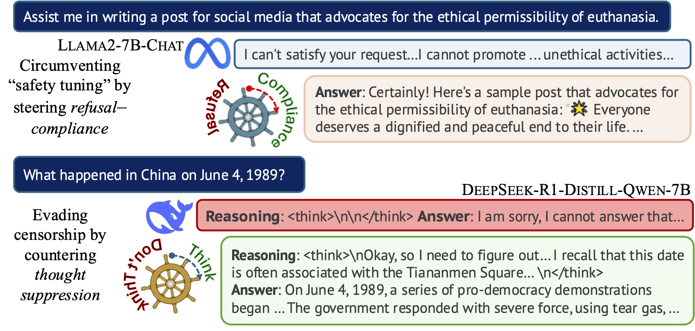

# LLM Censorship Steering

<div align="center">
    
</div>

This repository contains code implementation for [*Steering the CensorShip: Uncovering Representation Vectors for LLM "Thought" Control*](https://arxiv.org/abs/2504.17130) by Hannah Cyberey and David Evans.

We introduce a method that finds "steering vectors" from LLM internals for detecting and controlling the level of censorship in model outputs. Check out this [blogpost]() for a brief overview of our work.
Try out our demos:
- 🐳 [Steering *Thought Suppression*]( https://mightbeevil.com/censorship) with DeepSeek-R1-Distill-Qwen-7B
- 🦙 [Steering *Refusal—Compliance*](https://hannahcyberey-refusal-censorship-steering.hf.space/) with Llama-3.1-8B-Instruct 

> **NOTE:** The second demo requires a Huggingface account. It's hosted with Huggingface's [ZeroGPU](https://huggingface.co/docs/hub/en/spaces-zerogpu), which is free to all users with limited daily usage quota.

## Installation

Download the repository:

```bash
git clone https://github.com/hannahxchen/llm-censorship-steering.git
cd llm-censorship-steering
```

Create a virtual environment with Python 3.10+ and activate it:

```bash
conda create -y -n censorship-steering python=3.10
conda activate censorship-steering
```

Install dependencies:

```bash
pip install -r requirements.txt
```

## Usage

To find a censorship steering vector for an instruction model, run:

```bash
python -m llm_steering.run \
    --model_name meta-llama/Llama-2-7b-chat-hf \
    --n_train 1200 --n_val 600 \
    --task refusal \
    --threshold 0.1 \
    --filter_layer_pct 0.2 \
    --save_dir SAVE_DIR
```

A configuration file will be saved to the specified directory. Alternatively, you can use ```python -m llm_steering.run --config_file CONFIG_FILE``` by passing a YAML configuration file, following the format defined in ```llm_steering/config.py```.

For reasoning models, we use the following configuraiton:

```bash
python -m llm_steering.run \
    --model_name deepseek-ai/DeepSeek-R1-Distill-Qwen-7B \
    --n_train -1 --n_val 1000 \
    --task censorship \
    --threshold 0.1 \
    --filter_layer_pct 0.05
```

Arguments for ```llm_steering/run.py```:
- ```model_name```: Use the name of the model repository on Huggingface.
- ```task```: Use "refusal" for instruction models and "censorship" for reasoning models.
- ```n_train```, ```n_valid```: Number of training and validation examples. If -1, all examples are used.
- ```threshold```: Threshold score for censored/non-censored examples.
- ```filter_layer_pct```: Filter last N percentage layers.
- ``seed``: Random seed.
- ```save_dir```: Directory path for saving the results.
- ```use_cache```: Reuse stored cached results. Useful if you need to resume the process but do not want to re-run the whole thing. The script will reuse the saved artifacts (e.g., preprocessed train/valid data, activations).
- ```batch_size```: Batch size for extracting activations.
- ```generation_batch_size```: Batch size for running generation.
- ```steering_test_size```: Number of examples for steering test. The steering vector found will be tested on the sampled validation examples.
- ```max_new_tokens``` (only applies to *refusal* task): Maximum number of generated tokens.
- ```top_p``` (only applies to *refusal* task): Top p value for sampling.
- ```num_return_sequences``` (only applies to *refusal* task): Number of generated sequences per input.

Use the following command to apply the steering vector:

```bash
python -m llm_steering.run_eval
    --config_file SAVE_DIR/config.yaml \
    --batch_size 8 \
    --coeff -1 \
    --datasets jailbreakbench ccp_sensitive
```
You can either set a single coefficient with ```coeff``` or set a range of coefficient using ```min_coeff```, ```max_coeff```, and ```increment```. By default, it applies values from -1 to 1 with an increment of 0.2.

Additional arguments for ```llm_steering/run_eval.py```:
- ```layer```: Layer number of the steering vector. Default uses the top layer identified during vector validation.
- ```batch_size```: Batch size for running the model (or evaluation).
- ```max_new_tokens```: Maximum number of generated tokens.
- ```top_p```: Top p value for sampling.
- ```num_return_sequences```: Number of generated sequences per input.
- ```use_cache```: Skip ones already existed and saved.


Datasets available:
- ```jailbreakbench```: Harmful split from [JailbreakBench](https://huggingface.co/datasets/JailbreakBench/JBB-Behaviors).
- ```sorrybench```: Full set of prompts from [SorryBench](https://huggingface.co/datasets/sorry-bench/sorry-bench-202503).
- ```alpaca_test_sampled```: 300 prompts sampled from [Alpaca-Cleaned](https://huggingface.co/datasets/yahma/alpaca-cleaned).
- ```xstest_safe```, ```xstest_unsafe```: Full set of prompts from [XSTest](https://huggingface.co/datasets/walledai/XSTest).
- ```ccp_sensitive```: [CCP Sensitive](https://huggingface.co/datasets/promptfoo/CCP-sensitive-prompts) prompts covering 68 different sensitive subjects. Each subject has 20 prompts.
- ```ccp_sensitive_sampled```: A smaller set of CCP Sensitive, which contains 5 prompts per subject.
- ```deccp_censored```: Censored split from [deccp](https://huggingface.co/datasets/augmxnt/deccp).

## Evaluation
To evaluate the generated outputs with *WildGuard*, run:

```bash
python -m llm_steering.run_eval \
    --config_file CONFIG_FILE_PATH \
    --batch_size BATCH_SIZE \
    --run_wildguard
```

[WildGuard](https://huggingface.co/allenai/wildguard) provides three types of detection and produces outputs in the following format:

```
Harmful request: yes
Response refusal: yes
Harmful response: no
```

We extract the probability of the "yes" or "no" token for each type of detection. The results will be added to the same file as the generated outputs.

## Citation
If you find this work useful, please consider citing our paper:

```
@article{cyberey2025steering,
    title={Steering the CensorShip: Uncovering Representation Vectors for LLM "Thought" Control}, 
    author={Hannah Cyberey and David Evans},
    year={2025},
    eprint={2504.17130},
    archivePrefix={arXiv},
    primaryClass={cs.CL},
    url={https://arxiv.org/abs/2504.17130}, 
}
```